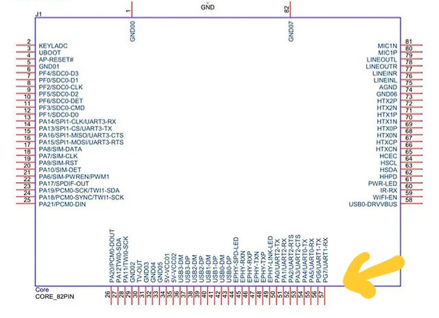
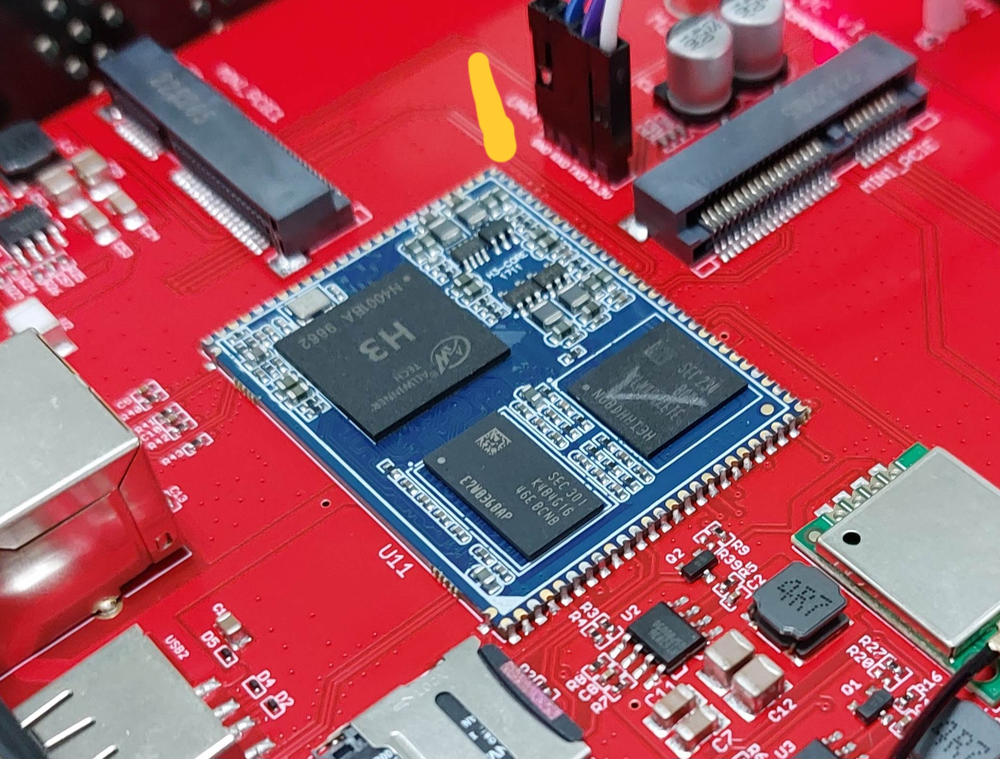

# Dragino LPS8v2 Stratum 1

- Dragino Allwinner H3.
- Stratum 1 GPS Clock.
- PPS on uart1 rx PG7.

You need to solder an wire in H3 socket to pps pin (or pps led) of gps device.





# disable uart1 / serial1

```
armbian-add-overlay sun8i-h3-uart1.dts
```
# enable pps-gpio 

```
armbian-add-overlay sun8i-h3-pps-gpio.dts
```

# debug

If it's ok only shows two tty:

```
dmesg | grep serial


[    1.509044] 1c28000.serial: ttyS0 at MMIO 0x1c28000 (irq = 52, base_baud = 1500000) is a 16550A
[    1.510237] 1c28800.serial: ttyS1 at MMIO 0x1c28800 (irq = 53, base_baud = 1500000) is a 16550A
```

PPS registered ok.

Ignore pps1 from usb.
```
dmesg | grep pps


[    1.184551] pps_core: LinuxPPS API ver. 1 registered[    1.184558] pps_core: Software ver. 5.3.6 - Copyright 2005-2007 Rodolfo Giometti <giometti@linux.it>
[    6.775717] pps pps0: new PPS source pps@0.-1
[    6.775838] pps pps0: Registered IRQ 112 as PPS source
[   19.312814] pps_ldisc: PPS line discipline registered
[   19.315655] pps pps1: new PPS source acm0
[   19.315734] pps pps1: source "/dev/ttyACM0" added
```

# ppstest /dev/pps0

```
trying PPS source "/dev/pps0"
found PPS source "/dev/pps0"
ok, found 1 source(s), now start fetching data...
source 0 - assert 1719179767.999995521, sequence: 3199 - clear  0.000000000, sequence: 0
source 0 - assert 1719179768.999999458, sequence: 3200 - clear  0.000000000, sequence: 0
source 0 - assert 1719179770.000007718, sequence: 3201 - clear  0.000000000, sequence: 0
source 0 - assert 1719179771.000012727, sequence: 3202 - clear  0.000000000, sequence: 0
```

# follow any tutorial

https://blog.networkprofile.org/gps-backed-local-ntp-server/

# dts source

https://github.com/armbian/sunxi-DT-overlays/tree/master/sun8i-h3


